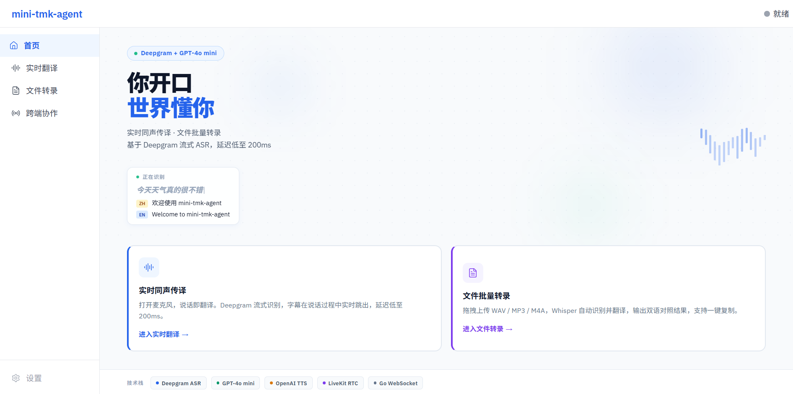

# mini-tmk-agent

> 实时同声传译 CLI Agent，基于 Go 构建。

---

## 功能亮点

**实时同声传译**
麦克风采集 → Deepgram Nova-2 流式 ASR → GPT-4o-mini 翻译，端到端延迟低至 200ms。文字在你说话的过程中逐字跳出（interim results），句子结束后立刻显示双语对照。

**文件批量转录**
拖入 WAV / MP3 / M4A / PCM 音频，Whisper-1 自动识别并翻译，输出双语对照文本，支持一键复制。

**TTS 语音输出（三档模式）**
- 无 TTS（默认）：仅文字显示
- 耳机模式（全双工）：麦克风与 TTS 同时工作
- 扬声器模式（半双工）：TTS 播放时自动暂停麦克风，避免回声

**跨端 RTC 实时协作（LiveKit）**
Speaker 端说话，Listener 端在另一台机器上实时收到文字和 TTS 语音。基于 LiveKit WebRTC Data Channel，穿透 NAT，支持跨互联网传输。

**Web UI**
Go 二进制内嵌 React SPA，启动即用，无需单独部署前端。支持实时翻译、文件转录、RTC 跨端三大功能页面。

**支持语言**
`zh` 中文 · `en` 英语 · `es` 西班牙语 · `ja` 日语

---

## Web UI 主页



---

## 环境依赖

- **Go 1.21+**
- **Node.js + npm**（`make build` 时编译前端）
- **PortAudio**（麦克风采集 + TTS 播放）
- **OPENAI_API_KEY**（所有模式）
- **DEEPGRAM_API_KEY**（实时 stream 模式）
- **LiveKit 三件套**（仅跨端 RTC 模式需要）

```bash
# macOS
brew install portaudio

# Linux (Ubuntu/Debian)
sudo apt install portaudio19-dev libportaudio2
```

仅使用文件转录模式时，只需要 `OPENAI_API_KEY`。

---

## 快速开始

```bash
# 1. 克隆并编译
git clone https://github.com/lucy6477777/mini-tmk-agent.git
cd mini-tmk-agent
make build

# 2. 配置 API Key
cp .env.example .env
# 编辑 .env，填入 OPENAI_API_KEY 等

# 3. 用示例音频验证本地环境
./bin/mini-tmk-agent transcript --file testdata/hello_zh.wav --output result.txt --source-lang zh
cat result.txt
```

---

## 配置

`.env` 文件在启动时自动加载，无需手动 `export`。

| 变量                  | 是否必须              | 用途                          | 申请地址                                                     |
| --------------------- | --------------------- | ----------------------------- | ------------------------------------------------------------ |
| `OPENAI_API_KEY`      | 必须                  | 转录 / 翻译 / TTS / Web       | [platform.openai.com](https://platform.openai.com/api-keys)  |
| `DEEPGRAM_API_KEY`    | 必须（实时 stream）   | CLI stream、Web 实时翻译页    | [console.deepgram.com](https://console.deepgram.com)         |
| `LIVEKIT_URL`         | 可选                  | RTC 跨端模式                  | [cloud.livekit.io](https://cloud.livekit.io)                 |
| `LIVEKIT_API_KEY`     | 可选                  | RTC 跨端模式                  | 同上                                                         |
| `LIVEKIT_API_SECRET`  | 可选                  | RTC 跨端模式                  | 同上                                                         |
| `OPENAI_BASE_URL`     | 可选                  | 自定义代理 / 兼容端点         | 你自己的服务                                                 |
| `WEB_PUBLIC_BASE_URL` | 可选                  | Web 二维码 / 手机访问         | 你自己的公网 URL                                             |

> `.env` 已加入 `.gitignore`，Key 不会被推到 GitHub。

---

## 使用方法

### Stream 模式 — 实时同声传译

```bash
# 基础用法：中译英
./bin/mini-tmk-agent stream --source-lang zh --target-lang en

# 耳机模式（全双工 TTS）
./bin/mini-tmk-agent stream --source-lang zh --target-lang en --tts

# 扬声器模式（半双工 TTS）
./bin/mini-tmk-agent stream --source-lang zh --target-lang en --tts --tts-speaker-mode

# 自定义 TTS 音色
./bin/mini-tmk-agent stream --source-lang zh --target-lang en --tts --tts-voice nova
```

终端输出示例：

```
[...] 今天天气        ← interim（灰色，说话过程中实时更新）
[SRC] 今天天气真好
[TGT] The weather is nice today
```

> 使用 TTS 时建议佩戴耳机。不戴耳机时 TTS 音频会被麦克风拾取，造成反馈环路。扬声器模式通过在播放时暂停麦克风来规避，但会丢失该时段的语音输入。

**跨端 RTC 模式（LiveKit）：**

```bash
# 终端 A（Speaker）：本地采集 + 翻译 + 发送到房间
./bin/mini-tmk-agent stream --source-lang zh --target-lang en \
  --room my-room --role speaker

# 终端 B（Listener，可在另一台机器上）：接收 + 显示 + TTS
./bin/mini-tmk-agent stream --source-lang zh --target-lang en \
  --room my-room --role listener --tts
```

Speaker A 说中文 → Listener B 实时看到英文文字并听到 TTS 语音，跨互联网传输。

按 `Ctrl+C` 停止。

### Transcript 模式 — 音频文件转录

仅需 `OPENAI_API_KEY`。

```bash
./bin/mini-tmk-agent transcript --file speech.mp3 --output result.txt
./bin/mini-tmk-agent transcript --file speech.m4a --output result.txt
./bin/mini-tmk-agent transcript --file audio.pcm --output result.txt --source-lang zh
```

支持格式：`.wav` · `.mp3` · `.m4a` · `.pcm`

### Web UI

```bash
./bin/mini-tmk-agent web --port 8080
```

打开浏览器访问 `http://localhost:8080`。

- 文件转录：需要 `OPENAI_API_KEY`
- 实时翻译：需要 `OPENAI_API_KEY` + `DEEPGRAM_API_KEY`
- 跨端协作：需要 `OPENAI_API_KEY` + `DEEPGRAM_API_KEY` + LiveKit 三件套

手机访问时，设置：

```bash
WEB_PUBLIC_BASE_URL=http://你的局域网IP:8080
```

### 全局 Flag

```
--api-key string            覆盖 OPENAI_API_KEY 环境变量
--base-url string           覆盖 OPENAI_BASE_URL 环境变量
--deepgram-api-key string   覆盖 DEEPGRAM_API_KEY 环境变量
```

---

## 测试

```bash
# 单元测试（无需 API Key）
make test

# 覆盖率报告
make test-cover

# 集成测试（需要 OPENAI_API_KEY，从 .env 或环境变量自动读取）
make test-integration
```

集成测试覆盖：
- **Whisper 转录**：上传真实音频文件，验证 pipeline 完整运行
- **GPT-4o-mini 翻译**：中→英、英→中、多语言，验证 prompt 格式和响应解析
- **OpenAI TTS**：验证 API 返回合法 PCM 字节流
- **Web WebSocket**：上传文件 → transcript 命令 → 完整收取消息直到 idle；stop 命令；无文件 transcript 报错

---

## 常见问题

**`OPENAI_API_KEY is not set`**
从模板创建 `.env` 文件并填入 Key：
```bash
cp .env.example .env
```

**`DEEPGRAM_API_KEY is required for stream mode`**
实时翻译模式必须，Transcript 模式不需要。

**PortAudio 错误**
```bash
# macOS
brew install portaudio
# Ubuntu/Debian
sudo apt install portaudio19-dev libportaudio2
```

**`make build` 在 Go 编译前就失败**
`make build` 会同时编译 React 前端，需要安装 Node.js 和 npm。

**Web UI 显示占位页而非应用**
```bash
make web-build
```

---

## 架构

```
Stream 模式（Deepgram 流式 ASR）：
  麦克风 → PortAudio → PCM 帧 → Deepgram WebSocket
    interim results → 终端灰色覆盖显示
    final results → GPT-4o-mini 翻译 → 终端固定显示
                                     → TTS goroutine → PortAudio 播放

Transcript 模式：
  音频文件（.wav/.mp3/.m4a/.pcm）→ Whisper-1 ASR → .txt 输出
```

- **Deepgram 流式 ASR**：音频帧通过 WebSocket 实时推送，服务端做 VAD 和 endpointing，返回 interim（实时跳字）和 final（完整句子）结果，感知延迟从 ~4s 降至 ~200ms。
- **TTS**：翻译结果通过独立 goroutine 异步送往 OpenAI TTS-1，PCM 24kHz 流式回传并经 PortAudio 播放，non-blocking channel 确保 TTS 不阻塞主流水线。
- **RTC 中继（LiveKit）**：Speaker 模式通过 WebRTC Data Channel（reliable 模式）向房间发布 interim/final 结果；Listener 模式无需麦克风，从房间接收消息后驱动显示和 TTS。
- **扬声器模式**：`atomic.Bool` 追踪 TTS 播放状态，播放期间跳过麦克风帧，避免回声。
- **优雅退出**：`Ctrl+C` 触发 `context.Cancel()`，通过 channel 级联传播到所有 goroutine。

---

## 项目结构

```
cmd/mini-tmk-agent/
  main.go                     CLI 入口（cobra）：stream, transcript, web
  web.go                      Web UI 子命令
config/config.go              API Key + Base URL 加载
internal/audio/
  capture.go                  PortAudio 麦克风采集（16kHz mono）
  vad.go                      RMS 能量 VAD 状态机
  file.go                     WAV/MP3/M4A/PCM 文件读取 + PCMToWAV
internal/asr/
  whisper.go                  Whisper-1 batch ASR 客户端
  deepgram.go                 Deepgram 流式 ASR（StreamClient/StreamSession）
internal/translate/openai.go  GPT-4o-mini 翻译客户端
internal/tts/
  tts.go                      TTS 客户端接口 + OpenAI TTS-1 实现
  player.go                   PortAudio PCM 播放（IsPlaying flag）
internal/rtc/
  livekit.go                  LiveKit RTC 客户端（Data Channel 收发）
internal/pipeline/
  stream.go                   实时流水线（含 TTS）
  transcript.go               文件转录流水线
  metrics.go                  JSONL 延迟/成本指标
internal/display/terminal.go  ANSI 终端：interim 覆盖 + final 固定显示
internal/web/                 Web UI 后端（WebSocket + 嵌入式 SPA）
web/                          React + TypeScript 前端源码
tests/unit/                   单元测试（无需 API Key）
tests/integration/            集成测试（需真实 API）
testdata/hello_zh.wav         测试音频
```

---

## 项目文档

- [docs/usage.md](docs/usage.md) — 安装、配置、CLI 与 Web UI 使用说明
- [docs/architecture.md](docs/architecture.md) — 系统设计、组件边界、运行时流程
- [docs/testing.md](docs/testing.md) — 测试策略、覆盖率工作流、如何添加测试

---
---

# mini-tmk-agent

> A simultaneous interpretation CLI agent built with Go.

---

## Feature Highlights

**Real-time simultaneous interpretation**
Microphone → Deepgram Nova-2 streaming ASR → GPT-4o-mini translation, end-to-end latency as low as 200ms. Words appear on screen as you speak (interim results), with bilingual output displayed the moment each sentence ends.

**Audio file transcription**
Upload WAV / MP3 / M4A / PCM audio. Whisper-1 automatically transcribes and translates, outputting bilingual side-by-side text with one-click copy.

**TTS audio output (three modes)**
- No TTS (default): text display only
- Headphone mode (full-duplex): microphone and TTS work simultaneously
- Speaker mode (half-duplex): mic automatically pauses during TTS playback to prevent echo

**Cross-device RTC collaboration (LiveKit)**
The speaker talks on one machine; the listener receives live text and TTS audio on another machine anywhere on the internet. Built on LiveKit WebRTC Data Channel with NAT traversal.

**Web UI**
React SPA embedded directly in the Go binary — launch and use immediately, no separate frontend deployment needed. Supports real-time translation, file transcription, and RTC collaboration pages.

**Supported languages**
`zh` Chinese · `en` English · `es` Spanish · `ja` Japanese

---

## Web UI


---

## Prerequisites

- **Go 1.21+**
- **Node.js + npm** for `make build` (frontend compilation)
- **PortAudio** for microphone capture and TTS playback
- **OPENAI_API_KEY** for all modes
- **DEEPGRAM_API_KEY** for real-time stream mode
- **LiveKit credentials** only for cross-device RTC mode

```bash
# macOS
brew install portaudio

# Linux (Ubuntu/Debian)
sudo apt install portaudio19-dev libportaudio2
```

For file transcription only, `OPENAI_API_KEY` is sufficient.

---

## Quick Start

```bash
# 1. Clone and build
git clone https://github.com/lucyliuu/mini-tmk-agent
cd mini-tmk-agent
make build

# 2. Configure API keys
cp .env.example .env
# Edit .env and fill in OPENAI_API_KEY etc.

# 3. Smoke test with the included sample audio
./bin/mini-tmk-agent transcript --file testdata/hello_zh.wav --output result.txt --source-lang zh
cat result.txt
```

---

## Configure

`.env` is loaded automatically on startup — no need to `export` manually.

| Variable              | Required?                | Used by                              | Where to get it                                             |
| --------------------- | ------------------------ | ------------------------------------ | ----------------------------------------------------------- |
| `OPENAI_API_KEY`      | Yes                      | transcript / translation / TTS / web | [platform.openai.com](https://platform.openai.com/api-keys) |
| `DEEPGRAM_API_KEY`    | Yes for real-time stream | CLI stream, web realtime page        | [console.deepgram.com](https://console.deepgram.com)        |
| `LIVEKIT_URL`         | Optional                 | RTC relay only                       | [cloud.livekit.io](https://cloud.livekit.io)                |
| `LIVEKIT_API_KEY`     | Optional                 | RTC relay only                       | Same as above                                               |
| `LIVEKIT_API_SECRET`  | Optional                 | RTC relay only                       | Same as above                                               |
| `OPENAI_BASE_URL`     | Optional                 | Custom proxy / compatible endpoint   | Your provider                                               |
| `WEB_PUBLIC_BASE_URL` | Optional                 | Web QR code / phone access           | Your own public URL                                         |

> `.env` is git-ignored. Your keys stay local and never get pushed to GitHub.

---

## Usage

### Stream Mode — Real-time simultaneous interpretation

```bash
# Basic: Chinese to English
./bin/mini-tmk-agent stream --source-lang zh --target-lang en

# Headphone mode (full-duplex TTS)
./bin/mini-tmk-agent stream --source-lang zh --target-lang en --tts

# Speaker mode (half-duplex TTS)
./bin/mini-tmk-agent stream --source-lang zh --target-lang en --tts --tts-speaker-mode

# Custom TTS voice
./bin/mini-tmk-agent stream --source-lang zh --target-lang en --tts --tts-voice nova
```

Terminal output example:

```
[...] 今天天气        ← interim (gray, updating as you speak)
[SRC] 今天天气真好
[TGT] The weather is nice today
```

> Headphones are recommended when using TTS. Without them, TTS audio may be picked up by the microphone, causing a feedback loop. Speaker mode mitigates this by pausing the mic during playback, but loses speech during that window.

**Cross-device RTC mode (LiveKit):**

```bash
# Terminal A (speaker): capture + translate + publish to room
./bin/mini-tmk-agent stream --source-lang zh --target-lang en \
  --room my-room --role speaker

# Terminal B (listener, can be on a different machine): receive + display + TTS
./bin/mini-tmk-agent stream --source-lang zh --target-lang en \
  --room my-room --role listener --tts
```

Speaker A talks in Chinese → Listener B sees English text and hears English TTS in real time, across the internet.

Press `Ctrl+C` to stop.

### Transcript Mode — Audio file transcription

Requires only `OPENAI_API_KEY`.

```bash
./bin/mini-tmk-agent transcript --file speech.mp3 --output result.txt
./bin/mini-tmk-agent transcript --file speech.m4a --output result.txt
./bin/mini-tmk-agent transcript --file audio.pcm --output result.txt --source-lang zh
```

Supported formats: `.wav` · `.mp3` · `.m4a` · `.pcm`

### Web UI

```bash
./bin/mini-tmk-agent web --port 8080
```

Open `http://localhost:8080` in your browser.

- File transcription: requires `OPENAI_API_KEY`
- Real-time translation: requires `OPENAI_API_KEY` + `DEEPGRAM_API_KEY`
- RTC collaboration: requires `OPENAI_API_KEY` + `DEEPGRAM_API_KEY` + LiveKit credentials

To access from a phone on the same network, set:

```bash
WEB_PUBLIC_BASE_URL=http://YOUR_LAN_IP:8080
```

### Global Flags

```
--api-key string            Override OPENAI_API_KEY environment variable
--base-url string           Override OPENAI_BASE_URL environment variable
--deepgram-api-key string   Override DEEPGRAM_API_KEY environment variable
```

---

## Tests

```bash
# Unit tests — no API key required
make test

# Coverage report
make test-cover

# Integration tests — reads OPENAI_API_KEY automatically from .env or environment
make test-integration
```

Integration test coverage:
- **Whisper transcription**: uploads a real audio file and verifies the full pipeline completes
- **GPT-4o-mini translation**: zh→en, en→zh, multi-language — validates prompt format and response parsing against the live API
- **OpenAI TTS**: verifies the API returns a valid PCM byte stream
- **Web WebSocket**: upload file → send `transcript` command → collect messages until idle; `stop` command; transcript with no file uploaded returns an error

---

## Troubleshooting

**`OPENAI_API_KEY is not set`**
Create `.env` from the template and fill in your key:
```bash
cp .env.example .env
```

**`DEEPGRAM_API_KEY is required for stream mode`**
Required for real-time translation. Transcript mode does not need Deepgram.

**PortAudio errors**
```bash
# macOS
brew install portaudio
# Ubuntu/Debian
sudo apt install portaudio19-dev libportaudio2
```

**`make build` fails before Go compilation**
`make build` also compiles the React frontend, so Node.js and npm must be installed.

**Web UI shows a placeholder page instead of the app**
```bash
make web-build
```

---

## Architecture

```
Stream mode (Deepgram streaming ASR):
  mic → PortAudio → PCM frames → Deepgram WebSocket
    interim results → terminal (overwriting gray text)
    final results → GPT-4o-mini translate → terminal display
                                          → TTS goroutine → PortAudio playback

Transcript mode:
  audio file (.wav/.mp3/.m4a/.pcm) → Whisper-1 ASR → .txt output
```

- **Deepgram streaming ASR**: Audio frames are pushed to Deepgram over WebSocket in real time. The server handles VAD and endpointing, returning interim results (words appear as you speak) and final results (complete utterance). Perceived latency drops from ~4s to ~200ms.
- **TTS**: Translation text is sent to OpenAI TTS-1 asynchronously via a dedicated goroutine. Audio streams back as PCM 24kHz and plays through PortAudio. A non-blocking channel ensures TTS never stalls the main pipeline.
- **RTC relay (LiveKit)**: In speaker mode, interim/final results are published to a LiveKit room via WebRTC Data Channel (reliable mode). In listener mode, no microphone is needed — the pipeline receives messages from the room and feeds them to display and TTS. LiveKit Cloud handles NAT traversal and global routing.
- **Speaker mode**: An `atomic.Bool` tracks TTS playback state. When active, the audio-sending goroutine skips mic frames during playback to prevent feedback.
- **Graceful shutdown**: `Ctrl+C` triggers `context.Cancel()`, propagated through all goroutines via channel cascade.

---

## Project Structure

```
cmd/mini-tmk-agent/
  main.go                     CLI entry point (cobra): stream, transcript, web
  web.go                      Web UI subcommand
config/config.go              API key + base URL loading
internal/audio/
  capture.go                  PortAudio microphone capture (16kHz mono)
  vad.go                      RMS energy VAD state machine
  file.go                     WAV/MP3/M4A/PCM file reading + PCMToWAV
internal/asr/
  whisper.go                  Whisper-1 batch ASR client
  deepgram.go                 Deepgram streaming ASR (StreamClient/StreamSession)
internal/translate/openai.go  GPT-4o-mini translation client
internal/tts/
  tts.go                      TTS client interface + OpenAI TTS-1 implementation
  player.go                   PortAudio PCM playback with IsPlaying flag
internal/rtc/
  livekit.go                  LiveKit RTC client (Data Channel send/receive)
internal/pipeline/
  stream.go                   Real-time streaming pipeline (with TTS)
  transcript.go               Sequential file transcription pipeline
  metrics.go                  JSONL latency/cost metrics
internal/display/terminal.go  ANSI terminal: interim (overwrite) + final display
internal/web/                 Web UI backend (WebSocket + embedded SPA)
web/                          React + TypeScript frontend source
tests/unit/                   Unit tests (no API key needed)
tests/integration/            Integration tests (real API)
testdata/hello_zh.wav         Test audio fixture
```

---

## Docs

- [docs/usage.md](docs/usage.md) — installation, configuration, CLI and Web UI walkthrough
- [docs/architecture.md](docs/architecture.md) — system design, component boundaries, runtime flows
- [docs/testing.md](docs/testing.md) — test strategy, coverage workflow, how to add tests
